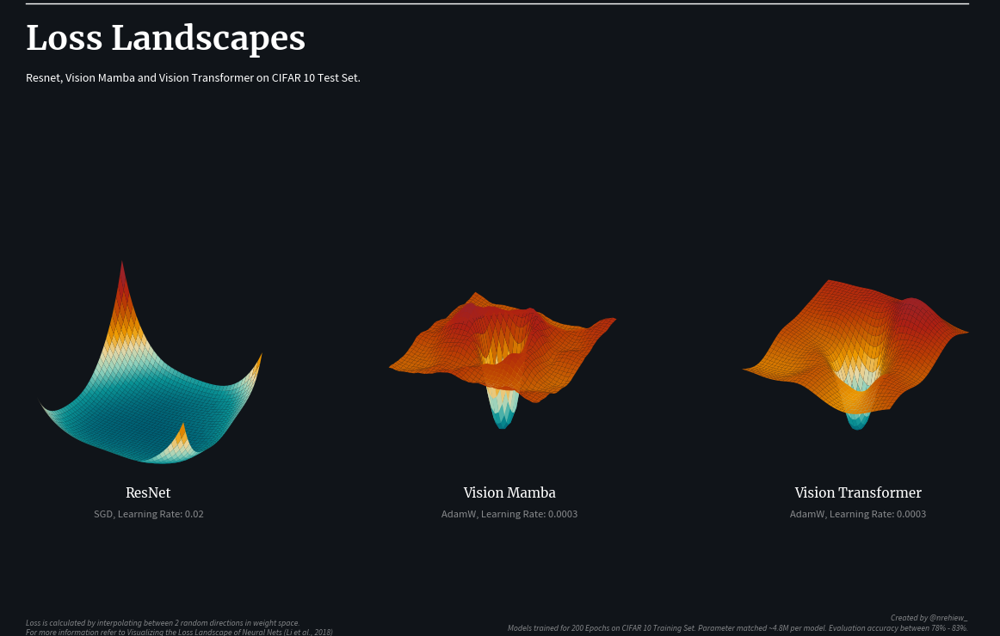

  

  
  

# Visualizing the Loss Landscape of Neural Nets

This code base implements the technique proposed in Visualizing the Loss Landscape of Neural Nets by Li et al. You can find their paper [here](https://arxiv.org/abs/1712.09913). The code is written in PyTorch and is based on the [original implementation](https://github.com/tomgoldstein/loss-landscape). The code follows the original implementation but is simplified to modern PyTorch and can be a single file.

The core algorithm follows: 
- Find 2 random directions in weight space. Because of the high dimensionality, these 2 directions are approximately orthogonal.
- We can then interpolate in these 2 directions to find a 2D plane in weight space.
- We project the loss function along these 2 directions and plot the loss landscape.

The important thing to note is to normalize the direction to have the same norm as the trained network for each parameter group.

This Repo contains examples for vision models and language models. The root `main.py` can be used as reference for other use cases.